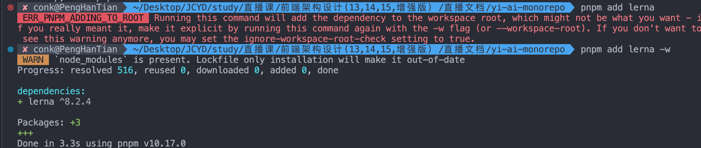
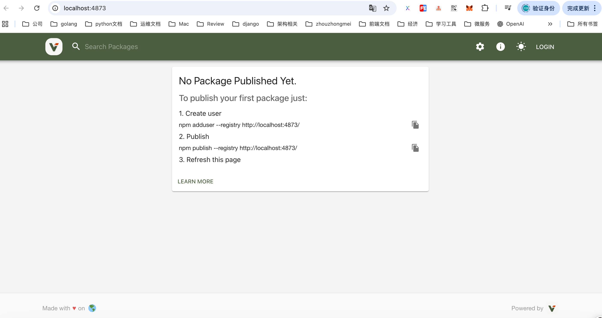

# Verdaccio
https://verdaccio.org/zh-CN/docs/what-is-verdaccio

- npm install -g verdaccio

- verdaccio

# 发包工具 
## rush
https://rushjs.io/zh-cn/pages/intro/get_started/

## Turborepo
https://turborepo.com/

## learn


# pnpm 中 `i` 和 `add` 命令的区别

在 pnpm 里，`i` 和 `add` 虽然都能安装依赖，但用途和场景有区别：

## 1. `pnpm i`（`pnpm install`）
- **主要功能**：安装 `package.json` 中已有的依赖。
- **使用场景**：
  - 项目第一次下载下来（比如从 Git clone），你要把 `package.json` 里的依赖全部安装好。
  - 或者你删掉了 `node_modules`，需要重新安装。
- **特点**：
  - 不会改动 `package.json` 和 `pnpm-lock.yaml`（除非有 `peerDependencies` 或 lock 不一致的情况）。
  - 只会根据现有依赖清单安装。

## 2. `pnpm add <package>`
- **主要功能**：安装新依赖，并写入 `package.json`。
- **使用场景**：
  - 想引入一个新的库，比如 `pnpm add axios`。
  - 可以指定依赖类型：
    - `pnpm add axios -D` → `devDependencies`
    - `pnpm add axios -g` → 全局安装
- **特点**：
  - 会更新 `package.json` 和 `pnpm-lock.yaml`。
  - 会安装最新版本（或你指定的版本）。

## ✅ 一句话总结：
- `pnpm i` → 装现有依赖（不会改 `package.json`）。
- `pnpm add` → 装新依赖并写进 `package.json`。


1. pnpm add lerna     


 
这个错误提示是 pnpm 在 Monorepo 工作区中给出的保护机制，防止你不小心将依赖安装到工作区根目录。
解决方法很简单，按照提示添加 -w 或 --workspace-root 标志，明确指定要安装到根目录：
bash
pnpm add lerna -D -w
解释：
-D 表示将 lerna 安装为开发依赖（推荐，因为 lerna 是构建工具）
-w 明确告诉 pnpm 要安装到工作区根目录
Lerna 通常是作为 Monorepo 项目的根目录工具使用的，所以这个安装方式是正确的。安装完成后，你就可以在根目录的 package.json 中看到 lerna 的依赖记录了。

pnpm add lerna --filter @yideng/cli

2. npx lerna init
3. pnpm add @yideng/libs --filter @yideng/hooks --workspace
4. pnpm --filter @yideng/hooks run dev 
5. 配置lerna.json
```js
{
  "$schema": "node_modules/lerna/schemas/lerna-schema.json", // 指定 JSON 模式文件的路径，用于提供配置的语法提示和校验，这里指向 Lerna 内置的模式文件，帮助编辑器（如 VS Code）识别配置结构。
  "npmClient": "pnpm", // 指定 Lerna 使用的包管理工具为 pnpm，Lerna 会通过 pnpm 来执行依赖安装、包管理等操作。
  "useWorkspaces": true, // 启用工作区（Workspaces）功能。结合 pnpm，Lerna 会利用 pnpm 的工作区机制来管理多包之间的依赖和链接，提升依赖安装效率和多包开发体验。
  "version": "independent", // 设置版本管理模式为 “独立版本”。即 Monorepo 中的每个包可以有自己独立的版本号，发布时可单独升级某个包的版本，而不是所有包同步版本。
  "packages": ["packages/*", "apps/*"], // 指定 Monorepo 中包的目录路径。packages/* 表示 packages 目录下的每个子目录都作为一个包；apps/* 同理，apps 目录下的子目录也作为包。
  "ignoreChanges": ["**/node_modules/**", "**/__snapshots__/**"], // 指定在检测包变化时忽略的文件或目录。这里忽略 node_modules 目录（依赖目录，变化通常不代表包本身逻辑变更）和 __snapshots__ 目录（一般是测试快照，变化也不代表包核心逻辑变更）。
  "command": { // 配置 Lerna 各类命令的具体行为。
    "publish": { // 配置 lerna publish（发布包）命令的行为。
      "conventionalCommits": true, // 启用 “约定式提交”。Lerna 会根据 Git 提交信息（需符合约定式提交规范，如 feat: 新增功能、fix: 修复 bug 等），自动判断版本升级类型（补丁版、 minor 版、 major 版），并生成 CHANGELOG。
      "message": "[skip ci] chore: release" // 指定发布时生成的 Git 提交信息内容。[skip ci] 是常见标记，用于提示持续集成（CI）工具跳过此次提交的 CI 流程；chore: release 说明这是一次 “日常维护类” 的发布提交。
    }
  }
}
// 错误lerna notice cli v8.2.4
// lerna ERR! ECONFIGWORKSPACES The "useWorkspaces" option has been removed. By default lerna will resolve your packages using your package manager's workspaces configuration. Alternatively, you can manually provide a list of package globs to be used instead via the "packages" option in lerna.json.
// Lerna v8 及以上版本已经移除了 useWorkspaces 配置项，不再需要手动设置该选项，它会自动读取包管理器（这里是 pnpm）的工作区配置。
// 解决方法很简单，修改 lerna.json 配置文件，删除 useWorkspaces: true 这一行即可：
```
6. npm login
7. verdaccio

8. pnpm run publish

- 确保 workspace 依赖

在 packages/yd-hooks/package.json 里，确认依赖写的是：

{
  "dependencies": {
    "@yideng/libs": "workspace:*"
  }
}

这样 pnpm 会用本地 workspace 包，而不会去 registry 拉。

然后执行：

pnpm install


生成正确的 lockfile。

先本地 publish libs

- 如果你真的要通过 registry（比如 Verdaccio）发布和安装：

先单独 publish @yideng/libs 到 registry：

cd packages/yd-libs
pnpm publish --registry http://localhost:4873 --access public


然后再跑 lerna publish

# Verdaccio
https://verdaccio.org/zh-CN/docs/what-is-verdaccio